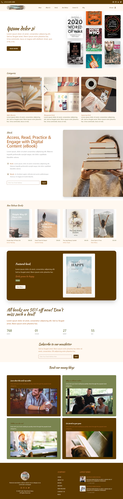

# 🦈📚 Projeto: Lélis Shark Book Store 📚🦈

Este projeto é uma landing page desenvolvida com **Tailwind CSS**, com foco em design moderno e responsivo.

✨ Destaques do Projeto
- Identidade visual: logomarca Lélis Shark Book Store criada manualmente no Canva
- Design de interface: layout inspirado em um modelo disponível na comunidade do Figma

🛠️ Tecnologias Utilizadas

- Tailwind CSS
- HTML 5
- CSS 3

Veja o projeto final aqui [https://lelisgustavo.github.io/Lelis-Shark-Book-Store/src/index.html]

---

# 🦈📚 Project: Lélis Shark Book Store 📚🦈

This project is a landing page developed with **Tailwind CSS**, with a focus on modern and responsive design.

✨ Project Highlights
- Visual identity: Lélis Shark Book Store logo created manually in Canva
- Interface design: layout inspired by a template available in the Figma community

🛠️ Technologies Used

- Tailwind CSS
- HTML 5
- CSS 3

See the final project here [https://lelisgustavo.github.io/Lelis-Shark-Book-Store/src/index.html]

---

# 🦈📚 Proyecto: Librería Lélis Shark 📚🦈

Este proyecto consiste en una landing page desarrollada con **Tailwind CSS**, con un enfoque en un diseño moderno y responsivo.

✨ Aspectos destacados del proyecto
- Identidad visual: Logotipo de la librería Lélis Shark creado manualmente en Canva
- Diseño de la interfaz: maquetación inspirada en una plantilla disponible en la comunidad Figma

🛠️ Tecnologías utilizadas

- Tailwind CSS
- HTML5
- CSS 3

Vea el proyecto final aquí [https://lelisgustavo.github.io/Lelis-Shark-Book-Store/src/index.html]